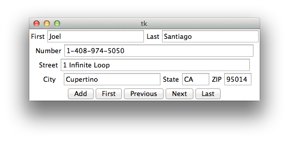

# Python Projects & Files

>This repo contains a random collection of files and projects that have helped me learn the language.  Some files come from the website [Learning Python The Hard Way](http://learnpythonthehardway.org/book/), others were projects that just happened to pique my interest.

## Table of Contents
* [Projects](#Projects)
* [Django Projects](#Django)
* [Learning Python The Hard Way](#LPTHW)
* [SQLite Projects](#SQLite)

## Projects

* #### Address Book
  As it's name states, this is a simple implementation of an address book.  In it's current state, the contents of the address book are written to a dat file.  In future versions, SQL queries will be used to read and write the data to a database file.  
  
  As for the UI, it currently consists of a simple layout, as this was my first attempt with TKinter.  The next iteration will contain a list box that would display all of your contacts within the list.
  
  

* #### RPG
  This is a simple CLI based RPG game that displays a grid that acts as a battle area.  Kind of pokemon-esque.  Enemies are dispersed randomly throughout the grid at varying amounts based on difficulty.  The user needs to make it through 10 choices without losing all their health and dying.  On each turn, they choose a pair of coordinates and hope that they don't run into an enemy.  
  
  When the user does run into an enemy, they are given the option to fight or run.  If they fight, they can choose attacks until either they or the enemy dies.  If they run, they play a game of chance as the enemy might attack them on their way out.  

  Once thier health reach 50 points or below, they are given the option to use a potion that heals them at random amounts.  The amount of potions granted is based upon the difficulty chosen earlier.
  
  The enemy names were based off characters from the film _The Cabin in the Woods_, which is almost entirely an _Evil Dead_ reference, among the fact that it references basically every horror film cliche to date.
    * _The Werewolf_
    * _Clowns_
    * _The Merman_
    * _The Sugarplum Fairy_
    * _Kevin_
    * _An Angry Molesting Tree_
    * _The Scarecrow Folk_
    * _The Zombie Redneck Torture Family_
    * _Deadites_
    * _Sasquatch_

* #### passwordHash
  This isn't really a big project, but I was curious how you can hash passwords so I made this.  
  
  It's a simple CLI based password tester that prompts the user to enter a password and then reenter the same password to test the hash.  Once the user enters the password initially, the password is hashed using the sha256 cryptographic hash function.  The user is then prompted again to enter the password, which then decodes the password and displays whether the password was entered correctly or not.

## Django Projects

Coming shortly...

## Learning Python The Hard Way
The files under this directory are works that are taught at [Learning Python The Hard Way](http://learnpythonthehardway.org/book/).  Some files were written as is on the site, while others contain variations to the code based on curiousity about the topic.

| Exercises                         | Exercises                              |
|-----------------------------------|----------------------------------------|
| 0 The Setup                       | 26 Congratulations, Take A Test!       |
| 1 A Good First Program            | 27 Memorizing Logic                    |
| 2 Comments And Pound Characters   | 28 Boolean Practice                    |
| 3 Numbers And Math                | 29 What If                             |
| 4 Variables And Names             | 30 Else And If                         |
| 5 More Variables And Printing     | 31 Making Decisions                    |
| 6 Strings And Text                | 32 Loops And Lists                     |
| 7 More Printing                   | 33 While Loops                         |
| 8 Printing, Printing              | 34 Accessing Elements Of Lists         |
| 9 Printing, Printing, Printing    | 35 Branches and Functions              |
| 10 What Was That?                 | 36 Designing and Debugging             |
| 11 Asking Questions               | 37 Symbol Review                       |
| 12 Prompting People               | 38 Doing Things To Lists               |
| 13 Parameters Unpacking Variables | 39 Dictionaries, Oh Lovely Dictionaries|
| 14 Prompting And Passing          | 40 Modules, Classes, And Objects       |
| 15 Reading Files                  | 41 Learning To Speak Object Oriented   |
| 16 Reading And Writing Files      | 42 Is-A, Has-A, Objects and Classes    |
| 17 More Files                     | 43 Gothons From Planet Percal #25      |
| 18 Names Variables Code Functions | 44 Inheritance Vs. Composition         |
| 19 Functions And Variables        | 45 You Make A Game                     |
| 20 Functions And Files            | 46 A Project Skeleton                  |
| 21 Functions Can Return Something | 47 Automated Testing                   |
| 22 What Do You Know So Far?       | 48 Advanced User Input                 |
| 23 Read Some Code                 | 49 Making Sentences                    |
| 24 More Practice                  | 50 Your First Website                  |
| 25 Even More Practice             | 51 Getting Input From A Browser        |
| 52 The Start Of Your Web Game     |                                        |

## SQLite Projects
These are small projects from a [Tutorial](http://zetcode.com/db/sqlitepythontutorial/) at [Zetcode](http://zetcode.com).  The implementations that I learned here will be applied to several other projects that would benefit from the ability to store and read files from a database file, instead of a simple dat file.